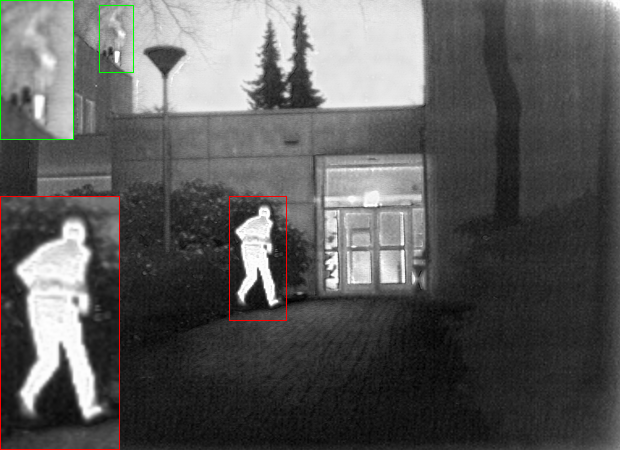

# Adaptive Dual-Branch Fusion: Enhancing Infrared-Visible Image Integration via Cross-Modality Learning

Official PyTorch Implementation

## 🔗 Project Overview

This repository contains the official implementation of **ACDFuse**, corresponding to the manuscript:

**“Adaptive Dual-Branch Fusion: Enhancing Infrared-Visible Image Integration via Cross-Modality Learning”**

If you use this code or find it helpful, **please consider citing our paper** .


**Abstract:**In the realm of image processing, the integration of infrared and visible imagery presents a significant challenge due to the need to balance thermal target highlighting with rich texture details. This study introduces ACDFuse, an Adaptive Cross-Modality Dual-Branch Fusion Network, designed to address this challenge by jointly modelling shared and unique features across modalities. The framework comprises a dual-branch encoder, incorporating a Serially Enhanced Representation Transformer Encoder for global semantic consistency and an Invertible Neural Network Encoder for modality-specific details. Adaptive and hierarchical fusion mechanisms, including an Adaptive Position-aware Cross Attention module and a Hierarchical Fusion Layer, facilitate precise alignment and complementary integration of cross-modal features. Extensive experiments on multiple public datasets demonstrate that ACDFuse outperforms state-of-the-art methods across both qualitative and quantitative evaluations, while consistently enhancing object detection performance, thereby validating its robustness and generalization capability.

**We are currently submitting to Pattern Analysis and Applications, and will provide the full code in the future.**


## 🛠️ 1. Environment Setup

### **1.1 Requirements**

```
Python >= 3.8
PyTorch >= 1.12
torchvision
numpy
opencv-python
scipy
tqdm
matplotlib
```

### **1.2 Create environment (recommended)**

```
conda create -n acdfuse python=3.8
conda activate acdfuse
pip install -r requirements.txt
```

## 🚀 2. Usage Instructions

### **2.1 Prepare datasets**

```
test_img/
    TNO/
        ir/
        vi/
    M3FD/
    ...
```

## **2.1 Run Test(Image Fusion)**

```
python test.py 
```

## **2.3 Train the Model**

```
python train.py \
    --batch_size 4 \
```

## 🧪 3. Example Results





## 📜 4. Relation to the Paper

This repository provides the **official implementation** of our paper:

**“Adaptive Dual-Branch Fusion: Enhancing Infrared-Visible Image Integration via Cross-Modality Learning”**
 Submitted to *Pattern Analysis and Applications*.

We open-source this code to enhance the **transparency, reproducibility, and usability** of our research.
 If this project helps your research, **please cite us**.
